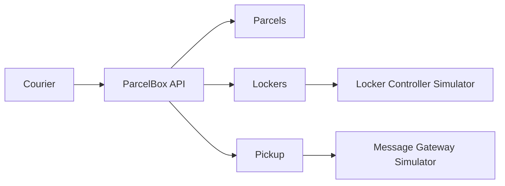

# ParcelBox Reference

`ParcelBox` je mali referentni sistem za računarske vežbe iz predmeta Elementi razvoja softvera.
Domen je namerno nepovezan sa glavnim studentskim projektom. Cilj repozitorijuma je da pokaže uredan .NET 10 projekat sa jasnim slojevima, poslovnim pravilima, spoljnim adapterima, testovima i normalnim Git tokom rada.

## Šta sistem radi

Kurir registruje paket, sistem bira odgovarajući pretinac, otvara ga preko simulatora kontrolera paketomata i generiše kod za preuzimanje. Kod se šalje preko simulatora message gateway-a. Primalac kasnije unosi kod i, ako je validan, sistem ponovo otvara isti pretinac i završava preuzimanje.



## Struktura

Repozitorijum koristi jednostavnu Clean Architecture podelu bez dodatnih framework slojeva.

```text
src/
├── ParcelBox.Domain/
│   ├── Parcels/
│   │   ├── Models/
│   │   └── Enums/
│   ├── Lockers/
│   │   ├── Models/
│   │   └── Enums/
│   ├── Pickup/
│   │   ├── Models/
│   │   └── Enums/
│   └── Common/
├── ParcelBox.Application/
│   ├── Abstractions/
│   ├── Common/
│   ├── Parcels/
│   ├── Lockers/
│   └── Pickup/
├── ParcelBox.Infrastructure/
│   ├── Persistence/
│   ├── External/
│   └── Security/
└── ParcelBox.Api/
    ├── Contracts/
    └── Endpoints/

simulators/
├── ParcelBox.Simulators.LockerController/
└── ParcelBox.Simulators.MessageGateway/

tests/
├── ParcelBox.Domain.Tests/
└── ParcelBox.Application.Tests/
```

Zavisnosti idu ka unutra:

```text
Api -> Application -> Domain
Api -> Infrastructure -> Application -> Domain
```

- `Domain` sadrži domenske modele, enum-e, poslovna pravila i domenske greške.
- `Application` sadrži use-case handlere, DTO modele i interfejse prema spoljnim zavisnostima.
- `Infrastructure` implementira persistence i spoljne adaptere.
- `Api` mapira HTTP zahteve na application use-case-ove i predstavlja composition root.
- jedan javni tip se drži u jednom fajlu; povezani tipovi se grupišu folderima, ne istim source fajlom.

Detaljnije obrazloženje je u [`docs/architecture.md`](docs/architecture.md).

## Pokretanje

Potrebni su .NET SDK 10 i, opciono, Docker.

### Lokalno

U tri terminala:

```bash
dotnet run --project simulators/ParcelBox.Simulators.LockerController
dotnet run --project simulators/ParcelBox.Simulators.MessageGateway
dotnet run --project src/ParcelBox.Api
```

Podrazumevani portovi:

- ParcelBox API: `http://localhost:5100`
- Locker Controller Simulator: `http://localhost:5101`
- Message Gateway Simulator: `http://localhost:5102`

Primeri HTTP zahteva nalaze se u `src/ParcelBox.Api/ParcelBox.Api.http`.

### Docker Compose

```bash
docker compose up --build
```

## Testovi

```bash
dotnet test
```

Domain testovi proveravaju poslovna pravila bez infrastrukture. Application testovi proveravaju orkestraciju use-case-a preko test doubles-a za portove.

## Pravila za referentni primer

Primer je namerno mali. Nema MediatR-a, message bus-a, generic repository-ja, outbox-a ili dodatnih slojeva bez konkretne potrebe. Fokus je na granicama, odgovornostima i čitljivosti koda.
