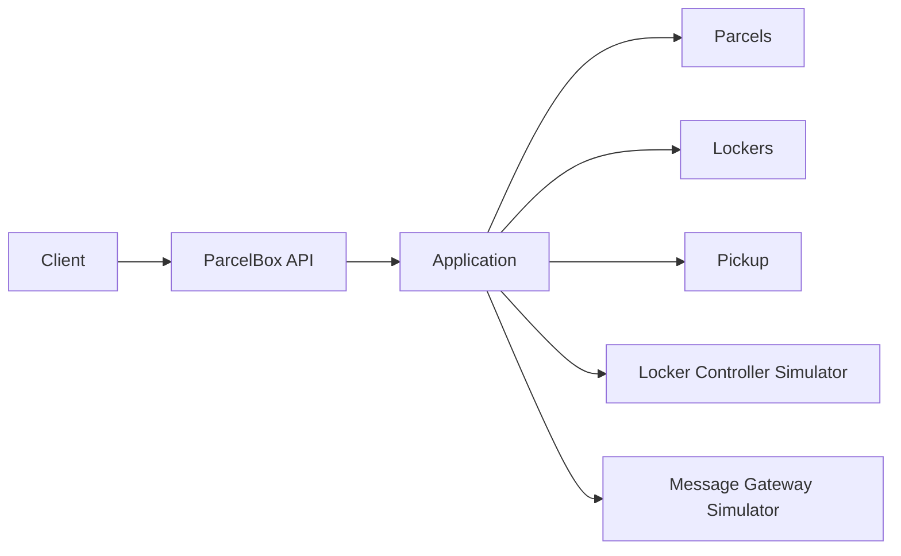

# ParcelBox Reference

`ParcelBox` je mali referentni sistem za računarske vežbe iz predmeta Elementi razvoja softvera.
Domen je namerno nepovezan sa glavnim studentskim projektom. Cilj je da repo pokaže uredan .NET 10 kod, jasne Clean Architecture granice, SOLID, typed Result pattern, testove i integraciju sa simulatorima bez nepotrebnog framework sloja.

## Šta sistem radi

Kurir registruje paket, sistem pronalazi odgovarajući pretinac i otvara ga preko Locker Controller simulatora. Nakon smeštanja generiše se pickup kod i pokušava slanje preko Message Gateway simulatora. Primalac kasnije unosi kod i sistem, ako su sva poslovna pravila zadovoljena, otvara isti pretinac i završava preuzimanje.



## Struktura

```text
src/
├── ParcelBox.Domain/
│   ├── Common/
│   │   ├── Enums/
│   │   │   └── SizeCategory.cs
│   │   └── Results/
│   │       ├── Result.cs
│   │       └── ResultOfT.cs
│   ├── Parcels/
│   │   ├── Models/
│   │   └── Enums/
│   ├── Lockers/
│   │   ├── Models/
│   │   └── Enums/
│   └── Pickup/
│       ├── Models/
│       └── Enums/
├── ParcelBox.Application/
│   ├── Abstractions/
│   │   ├── Persistence/
│   │   ├── External/
│   │   └── Security/
│   ├── Parcels/
│   │   └── Enums/
│   ├── Lockers/
│   └── Pickup/
│       └── Enums/
├── ParcelBox.Infrastructure/
│   ├── Persistence/
│   │   ├── Configurations/
│   │   └── Repositories/
│   ├── External/
│   └── Security/
└── ParcelBox.Api/
    ├── Contracts/
    ├── Endpoints/
    └── Extensions/

simulators/
├── ParcelBox.Simulators.LockerController/
└── ParcelBox.Simulators.MessageGateway/

tests/
├── ParcelBox.Domain.Tests/
└── ParcelBox.Application.Tests/
    └── TestDoubles/
```

Zavisnosti idu ka unutra:

```text
Api -> Application -> Domain
Api -> Infrastructure -> Application -> Domain
```

- `Domain` sadrži modele, domenske enum-e, poslovna pravila i generički typed `Result`.
- Domenske greške su enum vrednosti (`ParcelError`, `CompartmentError`, `PickupAccessError`), a ne statički katalozi stringova.
- `Application` orkestrira use-case-ove, mapira domenske ishode u application error enum-e i definiše male portove prema persistence-u, simulatorima i security servisima.
- `Infrastructure` implementira portove preko EF Core-a, `HttpClient`-a i standardnih kriptografskih API-ja.
- `Api` je transportni sloj: tek tu se typed error prevodi u HTTP status i tekst Problem Details odgovora.
- `SizeCategory` je zajednički domenski koncept koji koriste i paket i kapacitet pretinca; nema duplih `ParcelSize` / `CompartmentSize` enum-a ni mapping helper-a.
- `PickupAccess` je odgovoran samo za pickup kod, rok i pokušaje. Status slanja poruke nije deo tog domena.

Detaljnije obrazloženje je u [`docs/architecture.md`](docs/architecture.md).

## Result pattern

Domen ne koristi exception kao očekivani poslovni tok:

```csharp
Result<Parcel, ParcelError> registerResult = Parcel.Register(...);
Result<ParcelError> storeResult = parcel.Store(...);
```

Application ima svoj error ugovor, npr. `ParcelOperationError` i `PickupOperationError`. Time Domain ne zna za HTTP, spoljne servise ili presentation poruke.

## Pokretanje

Potrebni su .NET SDK 10 i, opciono, Docker.

### Lokalno

U tri terminala:

```bash
dotnet run --project simulators/ParcelBox.Simulators.LockerController
dotnet run --project simulators/ParcelBox.Simulators.MessageGateway
dotnet run --project src/ParcelBox.Api
```

Podrazumevani portovi:

- ParcelBox API: `http://localhost:5100`
- Locker Controller Simulator: `http://localhost:5101`
- Message Gateway Simulator: `http://localhost:5102`

Primeri HTTP zahteva nalaze se u `src/ParcelBox.Api/ParcelBox.Api.http`.

### Docker Compose

```bash
docker compose up --build
```

## Provera koda

```bash
dotnet restore
dotnet format whitespace --verify-no-changes --no-restore
dotnet build --configuration Release --no-restore
dotnet test --configuration Release --no-build
```

CI izvršava isti redosled. Formatiranje prati `.editorconfig` i standardni Visual Studio / `dotnet format` stil.

## Pravila za referentni primer

Primer je namerno mali. Nema MediatR-a, message bus-a, generic repository-ja, outbox-a ili dodatnih slojeva bez konkretne potrebe. Statičke klase ostaju samo tamo gde su prirodan .NET obrazac, npr. endpoint/DI extension metode i HTTP mapping na spoljašnjoj granici. Poslovno stanje i poslovne greške nisu sakriveni u statičkim string katalozima.
