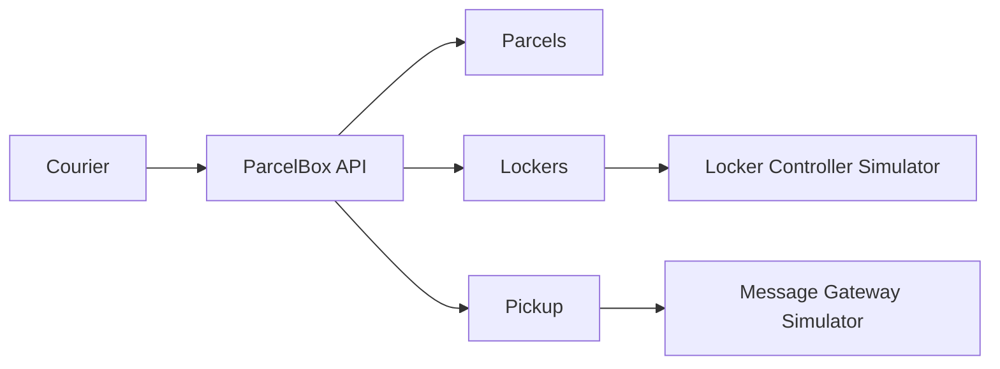

# ParcelBox Reference

`ParcelBox` je mali referentni sistem za računarske vežbe iz predmeta Elementi razvoja softvera.
Domen je namerno nepovezan sa glavnim studentskim projektom. Cilj repozitorijuma je da pokaže uredan .NET 10 projekat sa jasnim slojevima, poslovnim pravilima, spoljnim adapterima, Result pattern-om, testovima i normalnim Git tokom rada.

## Šta sistem radi

Kurir registruje paket, sistem bira odgovarajući pretinac, otvara ga preko simulatora kontrolera paketomata i generiše kod za preuzimanje. Kod se šalje preko simulatora message gateway-a. Primalac kasnije unosi kod i, ako je validan, sistem ponovo otvara isti pretinac i završava preuzimanje.



## Struktura

Repozitorijum koristi jednostavnu Clean Architecture podelu bez dodatnih framework slojeva.

```text
src/
├── ParcelBox.Domain/
│   ├── Common/
│   │   └── Results/
│   ├── Parcels/
│   │   ├── Models/
│   │   ├── Enums/
│   │   └── Errors/
│   ├── Lockers/
│   │   ├── Models/
│   │   ├── Enums/
│   │   └── Errors/
│   └── Pickup/
│       ├── Models/
│       ├── Enums/
│       └── Errors/
├── ParcelBox.Application/
│   ├── Abstractions/
│   │   ├── Persistence/
│   │   ├── External/
│   │   └── Security/
│   ├── Parcels/
│   ├── Lockers/
│   └── Pickup/
├── ParcelBox.Infrastructure/
│   ├── Persistence/
│   │   ├── Configurations/
│   │   └── Repositories/
│   ├── External/
│   └── Security/
└── ParcelBox.Api/
    ├── Contracts/
    ├── Endpoints/
    └── Extensions/

simulators/
├── ParcelBox.Simulators.LockerController/
└── ParcelBox.Simulators.MessageGateway/

tests/
├── ParcelBox.Domain.Tests/
└── ParcelBox.Application.Tests/
    └── TestDoubles/
```

Zavisnosti idu ka unutra:

```text
Api -> Application -> Domain
Api -> Infrastructure -> Application -> Domain
```

- `Domain` sadrži modele, enum-e, poslovna pravila, domenske greške i zajednički `Result` tip.
- očekivani poslovni neuspeh se vraća kroz `Result` / `Result<T>`; domen ne baca exception za validacione i statusne tokove.
- `Application` orkestrira use-case-ove i definiše male portove prema persistence-u, simulatorima i security servisima.
- `Infrastructure` implementira portove preko EF Core-a, `HttpClient`-a i kriptografskih API-ja.
- `Api` samo prevodi HTTP zahtev u application poziv i `Error` u odgovarajući HTTP problem response.
- jedan javni tip se drži u jednom fajlu; folderi grupišu tipove po odgovornosti.

Detaljnije obrazloženje je u [`docs/architecture.md`](docs/architecture.md).

## Pokretanje

Potrebni su .NET SDK 10 i, opciono, Docker.

### Lokalno

U tri terminala:

```bash
dotnet run --project simulators/ParcelBox.Simulators.LockerController
dotnet run --project simulators/ParcelBox.Simulators.MessageGateway
dotnet run --project src/ParcelBox.Api
```

Podrazumevani portovi:

- ParcelBox API: `http://localhost:5100`
- Locker Controller Simulator: `http://localhost:5101`
- Message Gateway Simulator: `http://localhost:5102`

Primeri HTTP zahteva nalaze se u `src/ParcelBox.Api/ParcelBox.Api.http`.

### Docker Compose

```bash
docker compose up --build
```

## Provera koda

```bash
dotnet restore
dotnet format whitespace --verify-no-changes --no-restore
dotnet build --configuration Release --no-restore
dotnet test --configuration Release --no-build
```

CI izvršava isti redosled. Formatiranje je vezano za `.editorconfig` i standardni `dotnet format`, tako da kod ostaje u uobičajenom Visual Studio stilu.

## Pravila za referentni primer

Primer je namerno mali. Nema MediatR-a, message bus-a, generic repository-ja, outbox-a ili dodatnih slojeva bez konkretne potrebe. Fokus je na granicama, odgovornostima, predvidivim rezultatima i čitljivosti koda.
