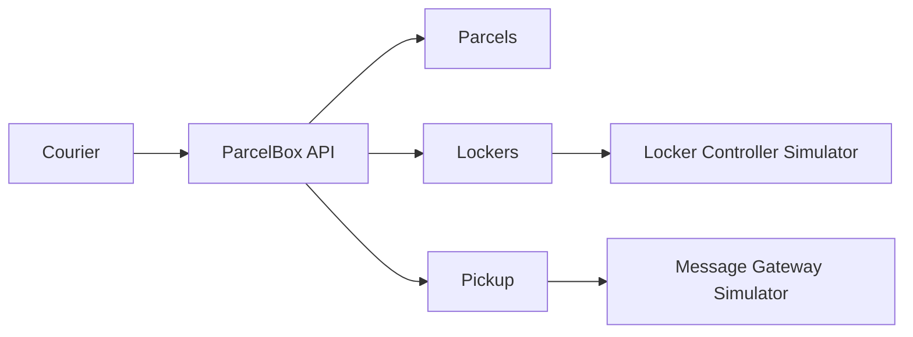

# ParcelBox Reference

`ParcelBox` je mali referentni sistem za računarske vežbe iz predmeta Elementi razvoja softvera.
Domen je namerno nepovezan sa glavnim studentskim projektom. Cilj repozitorijuma je da pokaže kako izgleda uredan .NET projekat sa jasnim granicama, poslovnim pravilima, spoljnim adapterima, testovima i normalnim Git tokom rada.

## Šta sistem radi

Kurir registruje paket, sistem bira odgovarajući pretinac, otvara ga preko simulatora kontrolera paketomata i generiše kod za preuzimanje. Kod se šalje preko simulatora message gateway-a. Primalac kasnije unosi kod i, ako je validan, sistem ponovo otvara isti pretinac i završava preuzimanje.



Tri male celine su:

- **Parcels** — registracija i životni ciklus paketa;
- **Lockers** — izbor i zauzimanje pretinca;
- **Pickup** — pickup kod, pokušaji unosa i završetak preuzimanja.

Spoljni sistemi su:

- **Locker Controller Simulator** — simulira fizičko otvaranje pretinca;
- **Message Gateway Simulator** — simulira slanje pickup koda.

## Arhitektura

Repozitorijum koristi jednostavnu Clean Architecture podelu:

```text
src/
├── ParcelBox.Domain/          poslovni model i pravila
├── ParcelBox.Application/     use-case-ovi i portovi
├── ParcelBox.Infrastructure/  EF Core i spoljni adapteri
└── ParcelBox.Api/             HTTP granica i composition root

simulators/
├── ParcelBox.Simulators.LockerController/
└── ParcelBox.Simulators.MessageGateway/

tests/
├── ParcelBox.Domain.Tests/
└── ParcelBox.Application.Tests/
```

Zavisnosti idu ka unutra:

```text
Api -> Application -> Domain
Api -> Infrastructure -> Application -> Domain
```

`Domain` ne zna za HTTP, EF Core, konfiguraciju ili simulatore. `Application` definiše interfejse koje `Infrastructure` implementira.

## Pokretanje

Potrebni su .NET SDK 10 i Docker samo ako želite da pokrenete sve procese jednom komandom.

### Lokalno

U tri terminala:

```bash
dotnet run --project simulators/ParcelBox.Simulators.LockerController
dotnet run --project simulators/ParcelBox.Simulators.MessageGateway
dotnet run --project src/ParcelBox.Api
```

Podrazumevani portovi su:

- ParcelBox API: `http://localhost:5100`
- Locker Controller Simulator: `http://localhost:5101`
- Message Gateway Simulator: `http://localhost:5102`

Primeri zahteva se nalaze u `src/ParcelBox.Api/ParcelBox.Api.http`.

### Docker Compose

```bash
docker compose up --build
```

## Demonstracioni tok

1. registrujte paket;
2. pozovite `store` za paket;
3. proverite poslednju poruku u Message Gateway simulatoru i uzmite pickup kod;
4. pozovite `pickup` sa tim kodom;
5. promenite Locker Controller u `Jammed` režim i ponovite scenario;
6. promenite Message Gateway u `Unavailable` režim i proverite da je paket ipak ostao smešten.

Važna namerna granica: neuspeh slanja poruke ne poništava uspešno fizičko smeštanje paketa. Za produkcioni sistem bi se dalje razmatrao outbox/retry mehanizam; ovde je ta kompleksnost namerno izostavljena.

## Build i testovi

```bash
dotnet restore
dotnet build --no-restore
dotnet test --no-build
```

Detaljnije obrazloženje strukture je u [docs/architecture.md](docs/architecture.md), a pravila doprinosa u [CONTRIBUTING.md](CONTRIBUTING.md).
