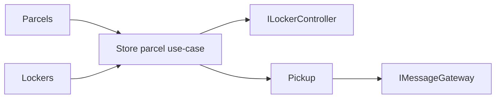

# Arhitektura

ParcelBox je namerno mali modularni monolit. Clean Architecture ovde služi da granice budu vidljive, a ne da broj projekata bude što veći.

## Slojevi

### Domain

`ParcelBox.Domain` je najunutrašnji sloj i nema zavisnost prema drugim projektima.

Sadrži:

- domenske modele (`Parcel`, `Compartment`, `PickupAccess`);
- enum-e koji predstavljaju domenska stanja i ishode;
- poslovna pravila u domenskim objektima;
- kataloge domenskih grešaka;
- `Result` i `Result<T>` kao eksplicitan način vraćanja očekivanog uspeha ili neuspeha.

```text
Domain/
├── Common/
│   └── Results/
├── Parcels/
│   ├── Models/
│   ├── Enums/
│   └── Errors/
├── Lockers/
│   ├── Models/
│   ├── Enums/
│   └── Errors/
└── Pickup/
    ├── Models/
    ├── Enums/
    └── Errors/
```

Očekivana poslovna stanja ne predstavljaju exception. Neispravan status, nevalidan unos, istekao pickup kod ili zauzet pretinac vraćaju `Result` sa strukturiranim `Error` objektom. Exception ostaje zaštita runtime-a za zaista neočekivane kvarove framework-a ili infrastrukture i ne koristi se kao poslovni kontrolni tok.

Domenske oblasti ne koriste međusobno svoje tipove: `Parcel` koristi `ParcelSize`, dok `Compartment` koristi `CompartmentSize`. Prevođenje između tih modela pripada Application sloju.

### Application

Application orkestrira use-case-ove. Ne sadrži EF Core ni `HttpClient` implementacije.

Portovi su grupisani po nameni:

```text
Abstractions/
├── Persistence/
├── External/
└── Security/
```

`ILockerController` i `IMessageGateway` takođe vraćaju `Result`, pa očekivani kvar simulatora ne postaje exception u poslovnom toku.

Vreme se dobija preko ugrađenog .NET `TimeProvider` tipa, što omogućava determinističke testove bez dodatnog clock framework-a.

### Infrastructure

Infrastructure implementira repository interfejse preko EF Core-a, spoljne portove preko `HttpClient` adaptera i generisanje/hash pickup koda preko standardnih kriptografskih API-ja.

EF mapiranja su izdvojena u `Persistence/Configurations`, repository implementacije u `Persistence/Repositories`, a `DbContext` ostaje fokusiran na EF session i registraciju konfiguracija.

### Api

API mapira HTTP zahteve na application use-case-ove. Ne ponavlja domenska pravila. `ErrorHttpExtensions` na jednom mestu prevodi `ErrorType` na HTTP status kod i Problem Details odgovor.

## Result pattern

Osnovni tok je eksplicitan:

```text
Domain/Application operation
        |
        +-- Result.Success(...)
        |
        +-- Result.Failure(Error)
                         |
                         +-- Code
                         +-- Message
                         +-- Type
```

Time pozivalac mora da obradi neuspeh, a poslovni tok nije sakriven kroz `try/catch` blokove.

## SOLID u ovom primeru

- **SRP**: entitet čuva svoja pravila, handler orkestrira use-case, repository radi persistence, adapter komunicira sa spoljnim sistemom, API prevodi transport.
- **OCP**: novi EF mapping se dodaje kroz novu `IEntityTypeConfiguration<T>` klasu bez širenja `DbContext.OnModelCreating` metode.
- **LSP**: application kod zavisi od malih ugovora; test doubles mogu da zamene infrastrukturu bez promene ponašanja handlera.
- **ISP**: persistence, external i security portovi su mali i namenski umesto jednog velikog servisnog interfejsa.
- **DIP**: Application zavisi od apstrakcija, dok EF Core, `HttpClient` i kriptografija ostaju u Infrastructure sloju.

## Granice celina



`Parcels`, `Lockers` i `Pickup` dele isti proces i bazu u ovom malom primeru, ali ne dele poslovna pravila niti direktno koriste međusobne domenske modele. Application sloj koordinira njihove rezultate.

## Namerna pojednostavljenja

- SQLite umesto posebnog DB servera;
- jedan `DbContext` za mali referentni sistem;
- sinhrona HTTP integracija sa simulatorima;
- nema message bus-a, MediatR-a, generic repository-ja ni posebnog Unit of Work wrappera;
- nema outbox-a; neuspešna isporuka poruke se pamti kao `Failed` i scenario se može ponoviti ručno.

Primer ostaje mali, ali granice slojeva, Result pattern i odgovornosti treba da budu eksplicitni i dosledni.
