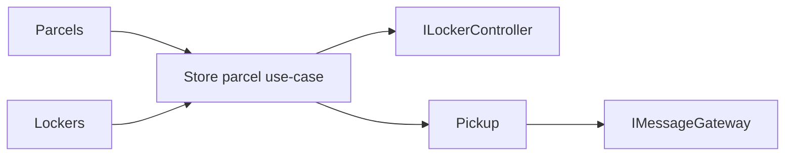

# Arhitektura

ParcelBox je namerno mali modularni monolit. Clean Architecture ovde služi da granice budu vidljive, a ne da broj projekata bude što veći.

## Slojevi

### Domain

Sadrži entitete, enum-e i poslovna pravila. Nema zavisnosti prema ASP.NET Core-u, EF Core-u ili simulatorima.

### Application

Sadrži use-case handlere i portove prema persistence-u i spoljnim sistemima. Handler koordinira tok, ali odluke poput dozvoljenih statusnih tranzicija ostaju u domenskim objektima.

### Infrastructure

Implementira repository interfejse preko EF Core-a, `ILockerController` preko `HttpClient` adaptera i `IMessageGateway` preko drugog `HttpClient` adaptera.

### Api

Mapira HTTP zahteve na application use-case-ove. `Program.cs` je composition root.

## Granice celina

`Parcels`, `Lockers` i `Pickup` dele isti proces i bazu u ovom malom primeru, ali ne dele poslovna pravila. Repository interfejsi su definisani u Application sloju i fokusirani su na potrebe konkretnog use-case-a.

## Namerna pojednostavljenja

- SQLite umesto posebnog DB servera;
- jedan `DbContext` za mali referentni sistem;
- sinhrona HTTP integracija sa simulatorima;
- nema message bus-a, MediatR-a, generic repository-ja ni posebnog Unit of Work wrappera;
- nema outbox-a; neuspešna isporuka poruke se pamti kao `Failed` i scenario se može ponoviti ručno.

Ova pojednostavljenja su svesna: primer treba da pokaže granice i odgovornosti bez infrastrukture koja zaklanja suštinu.
