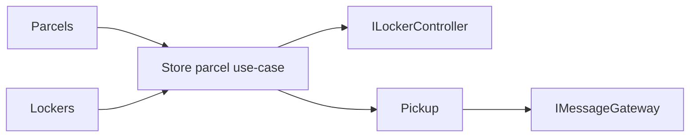

# Arhitektura

ParcelBox je namerno mali modularni monolit. Clean Architecture ovde služi da granice budu vidljive, a ne da broj projekata bude što veći.

## Slojevi

### Domain

`ParcelBox.Domain` je najunutrašnji sloj i nema zavisnost prema drugim projektima.

Sadrži:

- domenske modele (`Parcel`, `Compartment`, `PickupAccess`);
- enum-e koji predstavljaju domenska stanja i ishode;
- poslovna pravila u samim domenskim objektima;
- domenske greške.

Tipovi su organizovani po maloj domenskoj oblasti, a zatim po ulozi:

```text
Domain/
├── Parcels/
│   ├── Models/
│   └── Enums/
├── Lockers/
│   ├── Models/
│   └── Enums/
├── Pickup/
│   ├── Models/
│   └── Enums/
└── Common/
```

Domain ne zna za ASP.NET Core, EF Core, HTTP klijente, konfiguraciju ili simulatore. Domenske oblasti ne koriste međusobno svoje tipove: `Parcel` koristi `ParcelSize`, dok `Compartment` koristi `CompartmentSize`. Prevođenje između tih modela pripada Application sloju.

### Application

Sadrži use-case handlere i portove prema persistence-u i spoljnim sistemima. Handler koordinira tok, ali poslovne odluke poput dozvoljenih statusnih tranzicija ostaju u domenskim objektima.

Vreme je spoljašnja zavisnost use-case-a, pa se koristi ugrađeni .NET `TimeProvider`. Time su testovi deterministički bez uvođenja sopstvenog clock framework-a.

Interfejs i prateći enum/model nisu spojeni u isti source fajl. Jedan javni tip ima jedan fajl kako bi struktura bila jasna studentima.

### Infrastructure

Implementira repository interfejse preko EF Core-a, `ILockerController` preko `HttpClient` adaptera i `IMessageGateway` preko drugog `HttpClient` adaptera. Svaki repository ima svoj fajl, a EF mapiranja su izdvojena u `Persistence/Configurations` i automatski se registruju iz assembly-ja.

### Api

Mapira HTTP zahteve na application use-case-ove. Request modeli su u `Contracts`, endpoint klase u `Endpoints`, a `Program.cs` je composition root.

## Granice celina



`Parcels`, `Lockers` i `Pickup` dele isti proces i bazu u ovom malom primeru, ali ne dele poslovna pravila niti direktno koriste međusobne domenske modele. Application sloj je mesto na kome se te oblasti koordiniraju. Repository interfejsi su fokusirani na potrebe konkretnog use-case-a.

## SOLID u ovom primeru

- **SRP**: domen, orkestracija, persistence, HTTP adapteri i API transport imaju odvojene odgovornosti.
- **OCP**: novi EF mapping se dodaje kroz novu `IEntityTypeConfiguration<T>` klasu bez širenja `DbContext.OnModelCreating` metode.
- **LSP**: application kod zavisi od malih ugovora (`ILockerController`, `IMessageGateway`, repository interfejsi), pa test doubles mogu da zamene infrastrukturu bez promene ponašanja use-case-a.
- **ISP**: nema velikog servisnog interfejsa; portovi su mali i namenski.
- **DIP**: Application ne zavisi od EF Core-a ni `HttpClient` implementacija. Vreme koristi `TimeProvider`, a spoljne sisteme i persistence vidi kroz apstrakcije.

## Namerna pojednostavljenja

- SQLite umesto posebnog DB servera;
- jedan `DbContext` za mali referentni sistem;
- sinhrona HTTP integracija sa simulatorima;
- nema message bus-a, MediatR-a, generic repository-ja ni posebnog Unit of Work wrappera;
- nema outbox-a; neuspešna isporuka poruke se pamti kao `Failed` i scenario se može ponoviti ručno.

Primer ostaje mali, ali granice slojeva i odgovornosti treba da budu eksplicitne i dosledne.
