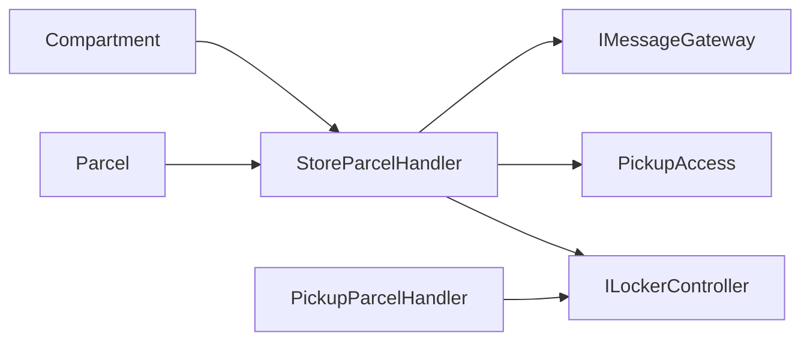

# Arhitektura

ParcelBox je namerno mali modularni monolit. Clean Architecture ovde služi da granice budu vidljive, a ne da broj projekata i apstrakcija bude što veći.

## Pravac zavisnosti

```text
Api -> Application -> Domain
Api -> Infrastructure -> Application -> Domain
```

`Domain` ne zavisi od ASP.NET Core-a, EF Core-a, `HttpClient`-a niti simulatora. `Application` ne zna kako su portovi implementirani. `Infrastructure` implementira portove, dok je `Api` composition root i HTTP granica.

## Domain

Domain sadrži poslovno stanje i pravila:

```text
Domain/
├── Common/
│   ├── Enums/
│   │   └── SizeCategory.cs
│   └── Results/
│       ├── Result.cs
│       └── ResultOfT.cs
├── Parcels/
│   ├── Models/
│   └── Enums/
├── Lockers/
│   ├── Models/
│   └── Enums/
└── Pickup/
    ├── Models/
    └── Enums/
```

`Parcel`, `Compartment` i `PickupAccess` čuvaju svoje invarijante. Očekivani neuspeh nije exception i nije string kod. Svaka oblast ima typed error enum:

- `ParcelError`;
- `CompartmentError`;
- `PickupAccessError`.

Generički Result je samo mehanizam prenosa ishoda:

```text
Result<TError>
Result<TValue, TError>
```

Na primer:

```csharp
Result<Parcel, ParcelError> registerResult = Parcel.Register(...);
Result<CompartmentError> occupyResult = compartment.Occupy(...);
```

Nema `Error.Code`, `Error.Message`, `ErrorType` ni statičkih `*Errors` kataloga u domenu. Time je neuspeh compile-time vidljiv i ne zavisi od tekstualnog identifikatora.

`SizeCategory` je mali shared domain koncept (`Small`, `Medium`, `Large`). Koriste ga i veličina paketa i kapacitet pretinca. To uklanja dupliranje dva ista enum-a i nepotrebni mapping između njih.

`PickupAccess` vodi samo pickup pristup: hash koda, rok važenja, broj neuspešnih pokušaja i status pristupa. Isporuka SMS/poruke je integraciona odgovornost i nije stanje `PickupAccess` entiteta.

## Application

Application orkestrira use-case-ove i definiše portove:

```text
Abstractions/
├── Persistence/
├── External/
└── Security/
```

Use-case greške su takođe enum-i, ali pripadaju Application sloju jer opisuju ceo use-case, a ne jednu domensku klasu:

- `ParcelOperationError`;
- `PickupOperationError`.

Handler mapira precizan domenski ishod u use-case ishod. Na primer `ParcelError.NotRegisteredForStorage` postaje `ParcelOperationError.NotRegisteredForStorage`, dok kvar spoljnog kontrolera postaje `LockerJammed` ili `LockerUnavailable`.

`ILockerController` i `IMessageGateway` vraćaju typed `Result` sa `LockerControllerError` odnosno `MessageGatewayError`. Infrastructure adapter zato pretvara očekivani HTTP kvar u eksplicitan rezultat umesto da transportni exception koristi kao poslovni tok.

Vreme se dobija preko ugrađenog .NET `TimeProvider` tipa. Testovi zato mogu da koriste determinističko vreme bez sopstvenog clock framework-a.

## Infrastructure

Infrastructure sadrži konkretne implementacije:

- EF Core repository-je;
- EF konfiguracije;
- SQLite `DbContext`;
- `HttpClient` adaptere prema simulatorima;
- generisanje i hash pickup koda.

`DatabaseInitializer` je normalan DI servis, a ne globalni static helper. EF konfiguracije su odvojene po entitetu, a svaki repository ima svoj fajl.

Transportne greške koje očekujemo (`HttpRequestException`, timeout spoljnog servisa) adapter prevodi u typed rezultat. Ne očekujemo da ostatak aplikacije poznaje `HttpClient` izuzetke.

## Api

API ne donosi poslovne odluke. Endpoint:

1. primi transportni model;
2. pozove handler;
3. vrati uspešan HTTP odgovor ili prevede application error enum u Problem Details.

Tek na API granici postoje tekstualne poruke za klijenta. `ErrorHttpExtensions` mapira enum na HTTP status i `detail`; ti stringovi nisu domenski identifikatori niti poslovno stanje.

Statičke klase u ovom sloju koriste se samo za idiomatske ASP.NET extension metode. To nije isto što i držanje poslovnih podataka u statičkim klasama.

## Result pattern

Tok je tipiziran:

```text
Domain
  Result<Value, DomainErrorEnum>
              |
              v
Application
  Result<Value, OperationErrorEnum>
              |
              v
Api
  HTTP Problem Details
```

Pozivalac mora eksplicitno da obradi neuspeh. Ne postoje `try/catch` blokovi za statusne tranzicije, validaciju koda ili nedostupan simulator.

## SOLID

- **SRP**: entitet čuva svoje pravilo; handler orkestrira use-case; repository radi persistence; adapter komunicira sa spoljnim sistemom; API prevodi transport.
- **OCP**: EF mapping je izdvojen u `IEntityTypeConfiguration<T>` klase, a novi adapter može da implementira postojeći mali port bez promene Application sloja.
- **LSP**: test double može da zameni repository, locker controller ili message gateway kroz isti ugovor i isti typed rezultat.
- **ISP**: persistence, external i security portovi su mali i namenski; nema jednog velikog servisnog interfejsa.
- **DIP**: Application zavisi od interfejsa, dok konkretni EF Core, `HttpClient` i kriptografski detalji ostaju u Infrastructure sloju.

## Granice odgovornosti



Važan detalj: neuspešno slanje poruke ne vraća skladištenje paketa unazad. Rezultat skladištenja samo izveštava `PickupMessageStatus.Failed`. Notification stanje zato nije ugurano u `PickupAccess` domen.

## Namerna pojednostavljenja

- SQLite umesto posebnog DB servera;
- jedan `DbContext` za mali referentni sistem;
- sinhrona HTTP integracija sa simulatorima;
- nema message bus-a, MediatR-a, generic repository-ja ni posebnog Unit of Work wrappera;
- nema outbox-a ni automatskog retry procesa za poruke;
- Result implementacija je mala i lokalna, bez dodatne biblioteke.

Primer ostaje mali, ali granice, tipizirani ishodi i odgovornosti treba da budu očigledni studentu koji prvi put otvori repo.
